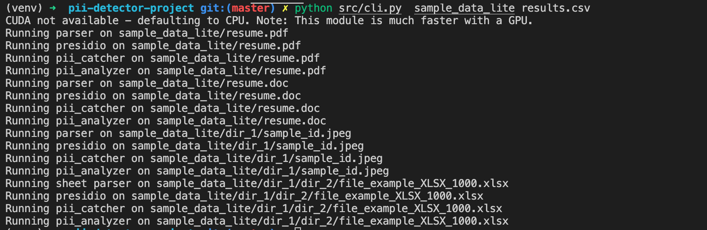
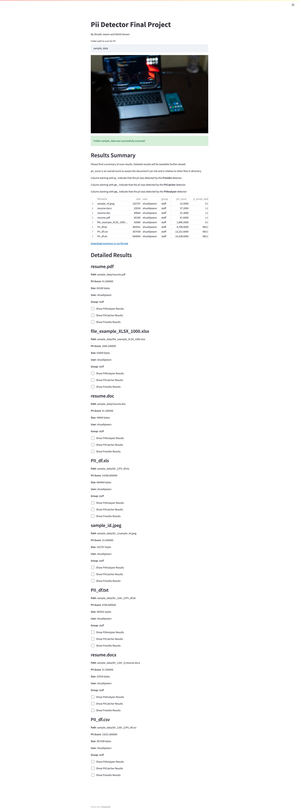

# PII Detector Final Project

Projects which traverses a given path, analyzes discovered files for PII, and generate a report output.

## Directory Structure

- `src/`: source code for app
- `src/parsers/`: parsers to extract text from multiple file formats
- `src/parsers/detectors`: pii detectors using Presidio, PIIAnalyzer, PIICatcher
- `sample_data/` : sample documents to be analyzed
- `sample_data_lite/` : sample documents to be analyzed with less files
- `images/`: images used in README
## Installation
### (For Windows Users) Microsoft Visual C++ Redistributable

Please install https://docs.microsoft.com/en-us/cpp/windows/latest-supported-vc-redist?view=msvc-170

### (For MacOS Users) Brew Packages

1. Install [Home Brew](https://brew.sh/) if you don't have it
2. Install dependencies using commands below
```
brew install --cask xquartz
brew install poppler antiword unrtf tesseract swig
```
### Java 8

Install Java 8 from [official website](https://www.oracle.com/java/technologies/downloads/#java8). You will need to create a free account if you don't have an Oracle account.

### Python dependencies

Switch to your virtual environment and run `pip install -r requirements.txt`

## Usage

Note:

- On Windows, reading `.doc` fails because antiword package is not available
- On Windows, reading the `owner` and `group` metadata of a file is not available
- **PLEASE** be sure to follow instructions in `SETUP` before running this project

### Command Line Interface

```
python src/cli.py  -h
usage: cli.py [-h] path results

Scan a folder for PII

positional arguments:
  path        folder path to scan
  results     where to place results

optional arguments:
  -h, --help  show this help message and exit
```



See `results.csv` for output example

### Graphical Interface 

`streamlit run src/app.py`


